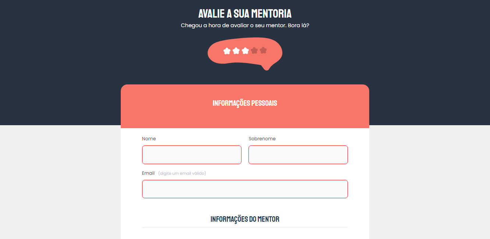
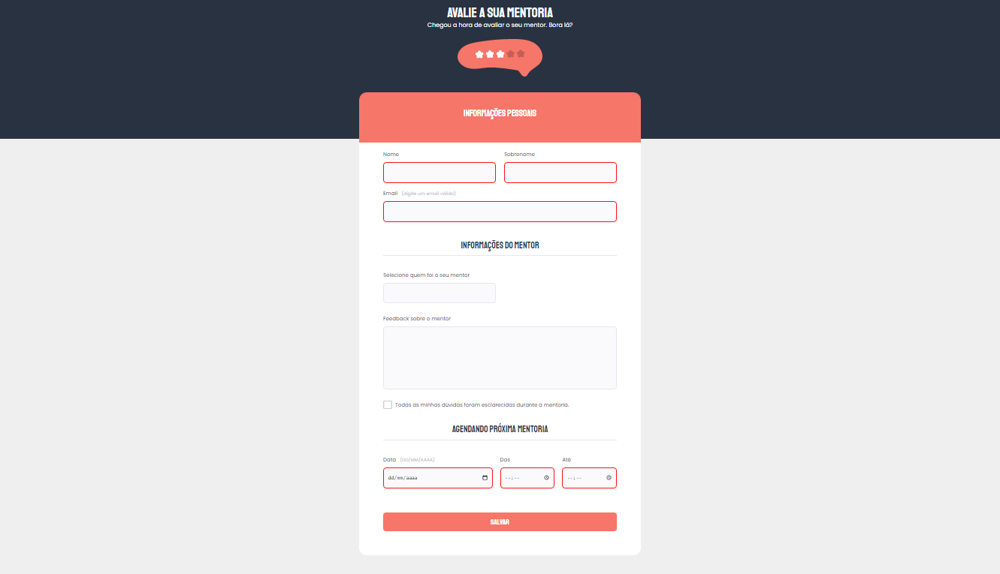

<h1 align="center">Mentorship Evaluation Form</h1>

  <a href="#-technologies">Technologies</a>&nbsp;&nbsp;&nbsp;|&nbsp;&nbsp;&nbsp;
  <a href="#-project">Project</a>&nbsp;&nbsp;&nbsp;|&nbsp;&nbsp;&nbsp;
  <a href="#memo-license">License</a>
  <a href="#readme-in-portuguese">License</a>

  

 
  

  &nbsp;&nbsp;&nbsp;

## 🚀 Technologies

This project was developed with the following technologies:

- HTML
- CSS
- Git and Github
- Figma

## 💻 Project

Challenge...
Mentorship evaluation form developed.

To access the finished project, click here.

## :memo: License

This project is under the MIT license.

by Fernando Rufino

`Project created by Rocketseat`

## README in Portuguese

<h1 align="center"> Formulário de Avalição da Mentoria </h1>

  <a href="#-tecnologias">Tecnologias</a>&nbsp;&nbsp;&nbsp;|&nbsp;&nbsp;&nbsp;
  <a href="#-projeto">Projeto</a>&nbsp;&nbsp;&nbsp;|&nbsp;&nbsp;&nbsp;
  <a href="#memo-licença">Licença</a>

  

 

  &nbsp;&nbsp;&nbsp;

## 🚀 Tecnologias

Esse projeto foi desenvolvido com as seguintes tecnologias:

- HTML
- CSS
- Git e Github
- Figma

## 💻 Projeto

Desafio... 
Desenvolvido formulário de avaliação da mentoria.

- Para acessar ao projeto finalizado, [clique aqui](https://fernandoalvesrufino.github.io/form-avaliacao-da-mentoria/).

 
## :memo: Licença

Esse projeto está sob a licença MIT.

---

by Fernando Rufino

`Projeto criado pela Rocketseat`
